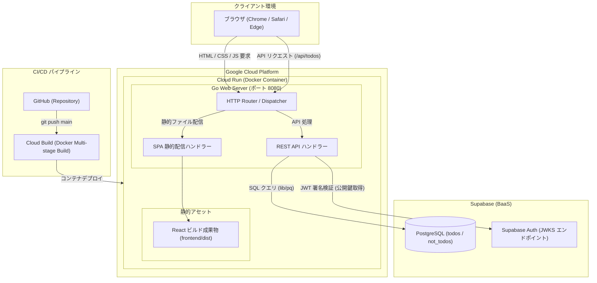
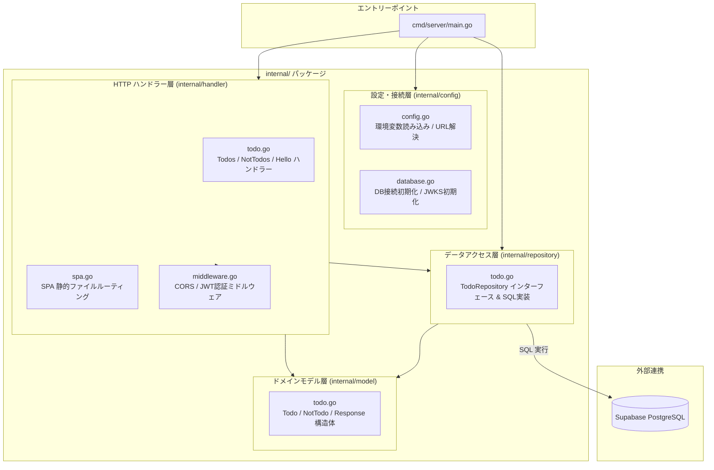
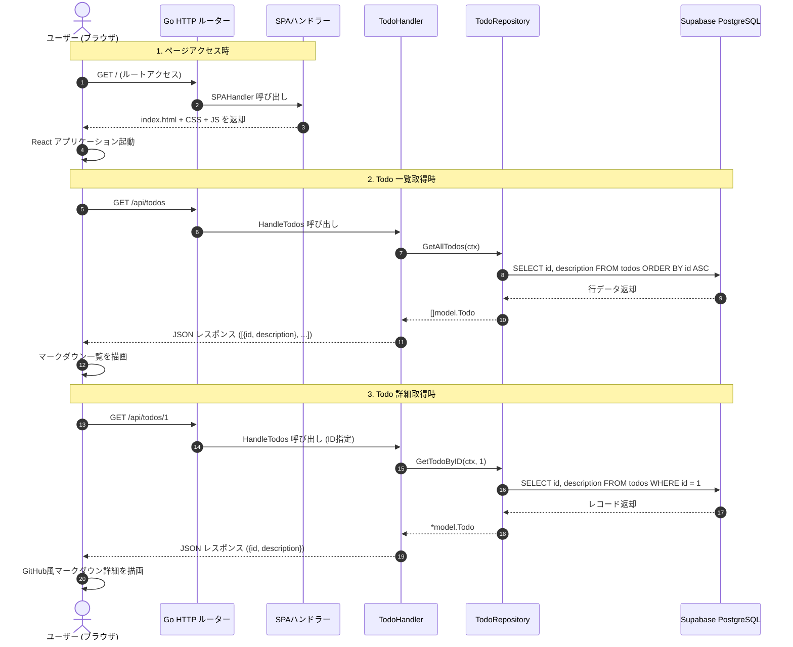
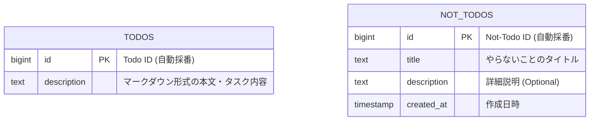
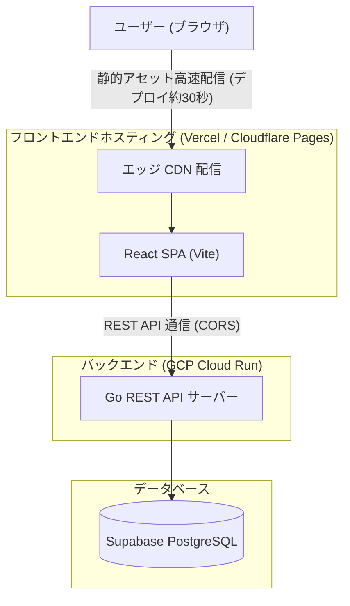

# システム構成仕様書 (Architecture)

本ドキュメントは、**StrandLog (My Portfolio)** アプリケーションのシステム構成、コードベースのレイヤー構造、データフローおよびデータベース構成をまとめたものです。

---

## 1. システム全体構成 (System Architecture)

アプリケーションは Google Cloud Run 上で単一のコンテナとして稼働し、Go バックエンドが React SPA の静的ファイル配信と REST API の両方を担当します。データベースおよび認証基盤には Supabase (PostgreSQL / Auth) を採用しています。



---

## 2. バックエンド レイヤー構成 (Backend Architecture)

バックエンド（Go）は、Go コミュニティで推奨される `cmd/` + `internal/` のパッケージ指向アーキテクチャを採用し、責務ごとに明確に分離されています。



---

## 3. リクエスト・データフロー (Data Flow)

ユーザーが画面を開き、Todo の一覧や詳細を取得する際の一連の処理フローです。



---

## 4. データベース構成 (Entity-Relationship)

現在アプリケーションが参照している Supabase PostgreSQL の主要テーブル構成です。



---

## 5. ディレクトリ構造

```text
my-portfolio/
├── .env.example                     # 環境変数のサンプルファイル
├── .gitignore                       # Git 除外設定
├── ARCHITECTURE.md                  # システム構成仕様書 (本ファイル)
├── Dockerfile                       # マルチステージ Docker ビルド設定
├── README.md                        # プロジェクト概要
├── SPEC.md                          # プロダクト仕様書 (StrandLog)
│
├── docs/                            # 各種ドキュメント
│   └── adr/                         # Architecture Decision Records (設計意思決定記録)
│       └── 0001-serve-frontend-from-go-backend.md
│
├── backend/                         # Go バックエンド
│   ├── cmd/
│   │   └── server/
│   │       └── main.go              # エントリーポイント
│   ├── go.mod                       # Go モジュール定義
│   ├── go.sum                       # 依存パッケージのチェックサム
│   └── internal/
│       ├── config/
│       │   ├── config.go            # 環境変数読み込み・Supabase URL解決
│       │   └── database.go          # DB接続・JWKS初期化
│       ├── handler/
│       │   ├── middleware.go        # CORSヘッダー / JWT認証
│       │   ├── spa.go               # SPA静的配信ハンドラー
│       │   └── todo.go              # Todos / NotTodos APIハンドラー
│       ├── model/
│       │   └── todo.go              # 構造体 (Todo, NotTodo, Response)
│       └── repository/
│           └── todo.go              # SQLクエリ実行層 (Repository パターン)
│
└── frontend/                        # React フロントエンド
    ├── package.json
    ├── vite.config.ts
    ├── tailwind.config.js
    └── src/
        ├── App.tsx                  # ルーティング & メインレイアウト
        ├── api.ts                   # バックエンド API クライアント
        ├── types.ts                 # 型定義
        ├── index.css                # 全体スタイル
        └── components/
            ├── MarkdownViewer.tsx   # GitHub風マークダウンレンダラー
            ├── TodoListView.tsx     # Todo一覧画面
            └── TodoDetailView.tsx   # Todo詳細画面
```

---

## 6. アーキテクチャの評価とトレードオフ (Evaluation & Trade-offs)

本セクションでは、「Go バックエンドで静的ファイル（React SPA）を同居配信する」現構成のメリット、課題、および将来的な分離案について整理します。

> [!NOTE]
> 本アーキテクチャ選定の背景、比較検討した代替案、および移行トリガーに関する詳細な意思決定記録は [docs/adr/0001-serve-frontend-from-go-backend.md](file:///Users/yamamotohiroto/dev_workspace/my-portforio/docs/adr/0001-serve-frontend-from-go-backend.md) を参照してください。

### 6.1 現在の構成（同居配信）のメリット

Go コミュニティには、Go 1.16 で導入された `embed` パッケージのように「フロントエンドも含めて単一バイナリ（Single Binary）にまとめ、1つ置くだけで完結させる」カルチャーがあり、ツール系や小〜中規模サービスで広く採用されています（例: PocketBase, Prometheus, Grafana など）。

* **インフラ管理が極限までシンプル**:
  Cloud Run 1サービスで完結するため、インフラ設定・運用コストを最小化できます。
* **CORS 問題の完全回避**:
  フロントエンド（`/`）とバックエンド（`/api/...`）が同一オリジンになるため、CORS エラーやオリジン間認証のトラブルが発生しません。
* **バージョン不整合の防止**:
  1つの Docker コンテナとして一括ビルド・デプロイされるため、「フロントだけ新しくて API が古い」といったバージョンのズレが起きません。

---

### 6.2 密結合による課題（CI/CD への影響）

* **フロント改修時にも Go の CI が毎回走る**:
  フロントエンドの文言や CSS を 1 行修正しただけでも、Cloud Build 上で Node.js ビルドと Go ビルドの両方が走り、デプロイ完了まで数分待つ必要があります。
* **ビルドエラーの巻き込み**:
  バックエンドに手を加えていなくても、Go 側の依存関係（`go.sum`）や設定エラーがある場合、フロントエンドの更新デプロイ全体が巻き込まれて停止します。
* **エッジ CDN の恩恵を受けにくい**:
  静的アセット（JS/CSS）が Cloud Run コンテナから配信されるため、CDN による世界規模のエッジキャッシュ配信に比べると配信速度・サーバー負荷の面で劣ります。

---

### 6.3 将来的な分離構成（ステップアップ案）

「フロントエンドの画面修正を頻繁に行い、数十秒で即座に反映させたい」場合やプロダクトが拡大した場合は、フロントエンドを **Vercel** または **Cloudflare Pages** に切り離す構成へステップアップすることが推奨されます。



#### 分離に必要な改修点
1. **フロントエンド**:
   API リクエストのベース URL を相対パス（`/api/todos`）から、環境変数（例: `VITE_API_BASE_URL`）経由で Cloud Run の完全修飾 URL を参照するように変更する。
2. **バックエンド**:
   Vercel / Cloudflare Pages からの通信を許可する CORS 設定（現状の `SetCORSHeaders` で既にワイルドカード対応済みのため即時対応可能）。

---

### 6.4 移行の判断基準とエビデンス (Decision Criteria & Evidence)

現行の「Go + React SPA 単一コンテナ構成」から「Vercel / Cloudflare Pages 分離構成」へ切り替えるべきかの判断基準と、各サービスの公式無料枠エビデンスです。

#### 移行の判断基準（トリガー）
個人開発・ポートフォリオの段階では、**「無料枠内に収まり、開発体験に大きな支障が出ない限りは現行構成を維持する（YAGNI原則）」** という方針をとります。

1. **コストトリガー（課金の発生）**:
   Cloud Build の無料枠（月間 2,500 ビルド分）を超過し、CI/CD の費用請求が発生し始めたとき。
2. **DXトリガー（待ち時間ストレス）**:
   フロントエンドの微修正やUIデザインの試行錯誤が増え、毎回 3〜5 分の CI ビルド待ち時間が開発効率のボトルネックになったとき。

#### 主要サービスの無料枠エビデンス（公式リンク）

| サービス | 無料枠の内容 | 根拠・公式ドキュメント |
| :--- | :--- | :--- |
| **Google Cloud Build** | **月間 2,500 ビルド分** 無料<br/>（1ビルド3分の場合：月約830回のデプロイまで完全無料） | [Cloud Build の料金（公式）](https://cloud.google.com/build/docs/pricing?hl=ja)<br/>*「請求先アカウントごとに毎月 2,500 ビルド分が無料で提供されます」* |
| **Google Cloud Run** | **月間 200 万リクエスト** 無料<br/>360,000 GB 秒のメモリ / 180,000 vCPU 秒 | [Cloud Run の料金（公式）](https://cloud.google.com/run/pricing?hl=ja) |
| **Supabase** | **データベース 500MB** 無料<br/>月間 50,000 MAU (アクティブユーザー) | [Supabase Pricing（公式）](https://supabase.com/pricing) |

> [!NOTE]
> 現在のスタックはすべて強力な無料枠でカバーされており、個人開発の範囲（1日数回〜数十回のpush）であれば、毎月のインフラ費用は 0 円（無料枠内）で運用可能です。そのため、コスト面を理由とした分離の緊急度は極めて低く、機能実装を最優先に進めることができます。
